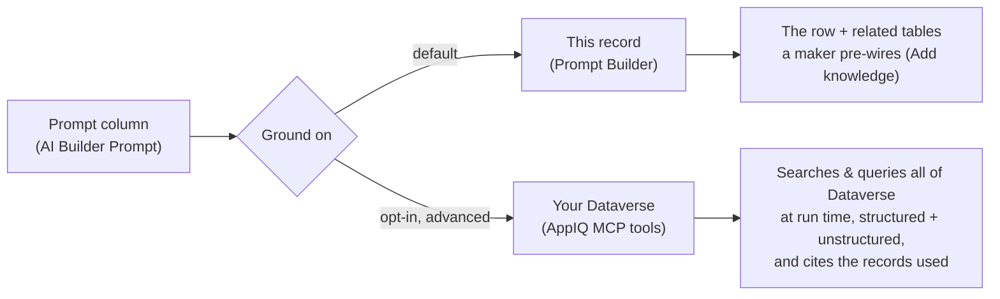
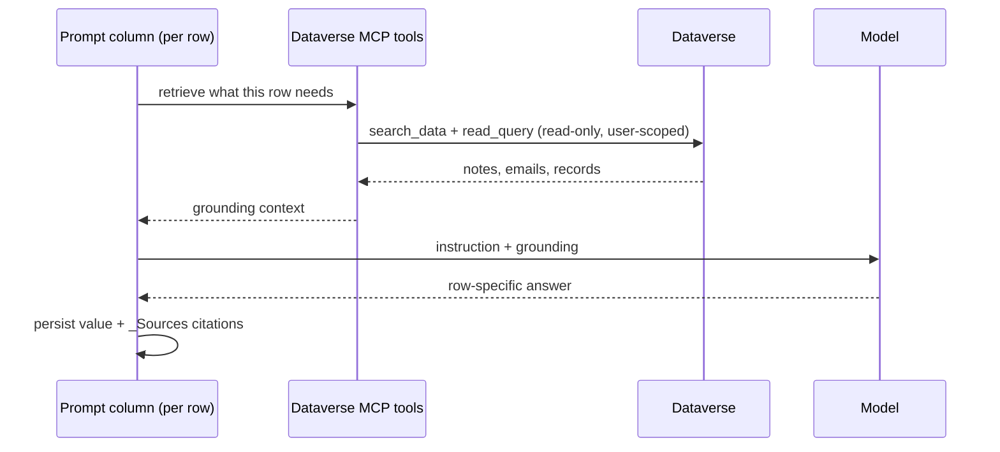
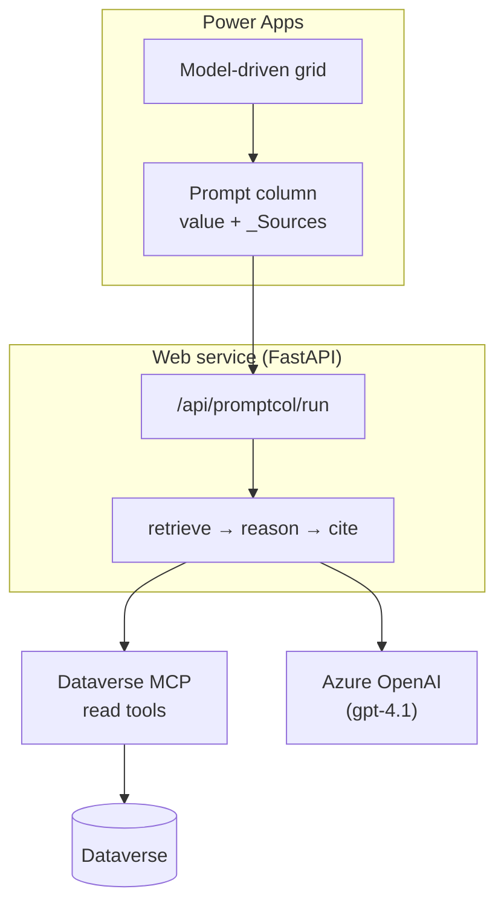
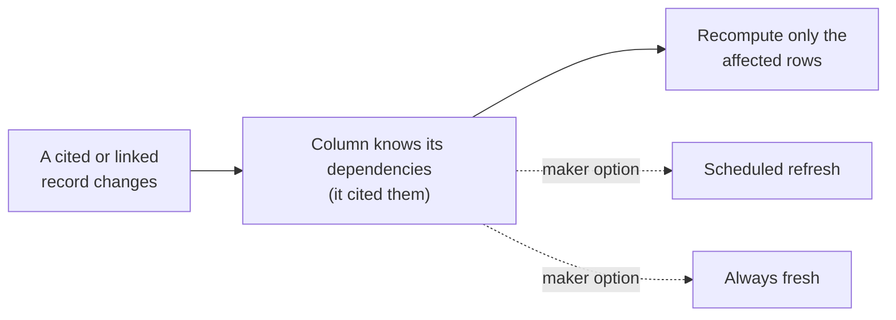

# Grounded Prompt Columns

Give a Microsoft Dataverse **prompt column** a second grounding option. Instead of
seeing only its own row, the column can call the **Dataverse MCP tools** at run time
to search and query the whole org, and it **cites** the records it used.

Opt-in and non-breaking: **This record (Prompt Builder)** stays the default;
**Your Dataverse (AppIQ)** is the advanced mode.

> **Disclosure.** This repo is an external prototype that *emulates* the proposed
> native behavior with supported, public building blocks (Dataverse retrieval, an
> LLM for generation, Web API write-back). It is not a change to the shipping Prompt
> Columns feature. It exists to show customer value and de-risk the design.

## The two grounding options



Today a prompt column grounds on its row plus any related tables a maker wires up in
advance. The advanced option adds three things a fixed, maker-wired column **cannot**
do:

1. **Run-time tool-calling**, the model decides what to fetch per row (not fixed at design time).
2. **Semantic search** over unstructured notes, emails, and files (not just attribute filters).
3. **Relational query and aggregation** across tables (JOIN, GROUP BY, unrelated tables).

The output surface is identical to today: a persisted value, a `_Sources` citation
set, and a status. Nothing downstream changes.

## How a grounded column runs, per row



**Retrieve → Reason → Cite.** Each row gets its own answer; "your Dataverse" is the
grounding it retrieves from, not one shared org-wide result.

## The Dataverse MCP tools

Read-only tools exposed to a prompt column:

| Tool | What it does |
| --- | --- |
| `search_data` | Semantic search over notes, emails, and files (needs Dataverse search on) |
| `search` | Keyword search across records and metadata |
| `read_query` | Relational query, JOINs, and aggregates (SELECT) |
| `fetch` | Retrieve a full record to cite |
| `describe_table` | Inspect a table's schema, columns, relationships |
| `list_tables` | Discover the tables in the environment |

The write and delete tools (`create_record`, `update_record`, `delete_record`,
`create_table`, `update_table`, `delete_table`) are **never** exposed to a prompt
column. Retrieval is read-only and trimmed to what the signed-in user may see.

## Architecture



In the live web demo, `promptcol.py` runs the per-row loop: it retrieves the relevant
records (semantic search over notes plus a query over related records), sends the
instruction and grounding to the model, and returns the answer with real, clickable
citations. On the trial org, Dataverse search (`search_data`) is disabled, so the
semantic step is an LLM meaning-match over the real records; swapping in live
`search_data` is a single seam.

## Staying fresh



Because each value cites the records it used, the column knows its own dependencies.
The default is **refresh on change**: when a cited or associated record updates, only
that row recomputes. The maker can instead choose **always fresh** or a **schedule**.
Only affected rows recompute, never the whole table for no reason.

## Run it

### CLI prototype (no install, no org)

Requires only Python 3.10+.

```bash
python3 cli.py demo                # grounded, cited answers for every account
python3 cli.py demo --baseline     # what a same-row prompt column shows today
python3 cli.py compare contoso     # baseline vs grounded, side by side
python3 cli.py sources contoso     # the citations behind one cell
python3 cli.py secure contoso      # same cell, full vs restricted permissions
python3 cli.py refresh             # backfill, change one record, refresh cheaply
```

### Web demo (Power Apps themed)

`web/` is a FastAPI service (Python 3.12) that serves a Power Apps themed UI
(command-bar purple `#742774`, Segoe UI) and the grounded Renewal Risk column.

- The grid shows the column grounded and cited on every row.
- The **Edit prompt** pop-up shows both grounding options; on **Your Dataverse
  (AppIQ)** the MCP tools are selectable (Auto / Choose) and the **Test** runs live.
- **Mock mode** (default) needs no credentials. The live **Test** uses Azure OpenAI
  (endpoint and key supplied via env / Container App secret, never committed).

```bash
cd web
python -m venv .venv && .venv/bin/pip install -r requirements.txt
AOAI_ENDPOINT=https://YOURAOAI.openai.azure.com/ AOAI_KEY=... AOAI_DEPLOYMENT=gpt-4.1 \
  .venv/bin/uvicorn app.main:app --port 8000       # http://127.0.0.1:8000
```

Deploy to Azure Container Apps (build in ACR, imperative `az containerapp`):

```bash
az acr build -r YOURACR -t gpc-web:latest web
az containerapp update -n gpc-web -g YOUR_RG --image YOURACR.azurecr.io/gpc-web:latest \
  --set-env-vars AOAI_ENDPOINT=... AOAI_DEPLOYMENT=gpt-4.1 AOAI_KEY=secretref:aoai-key
```

## Project layout

```
cli.py                      command-line demo
src/gpc/                    the mock-runnable prototype (ground / generate / cite / refresh)
web/app/
  promptcol.py              per-row retrieve → reason → cite via the Dataverse MCP read tools
  llm.py                    Azure OpenAI client for the live Test
  routers/promptcol.py      /api/promptcol/run and /status (the MCP tool catalog)
  dataverse.py, records.py  live Dataverse retrieval + grounding and citations
  static/index.html         the Power Apps grid + Edit-prompt pop-up (both grounding options)
docs/
  architecture.md           design, the moat, and diagrams
  webpage-copy.md           the proposal website copy
```

## How it maps to the proposal

| In this repo | Proposed native feature |
| --- | --- |
| `promptcol.py` run-time MCP tool-calling | Advanced grounding option on the prompt column |
| `_Sources` citations (`citations.py`, live sources) | Persisted citations |
| `refresh.py` change-only recompute | On-change / scheduled freshness |
| Read-only MCP tool set, user-scoped retrieval | Read-only, security-trimmed guardrail |

## Status

Prototype. The CLI mock mode is fully runnable today; the web demo runs live against
Azure OpenAI with real cited records. See `docs/architecture.md` for the design.
