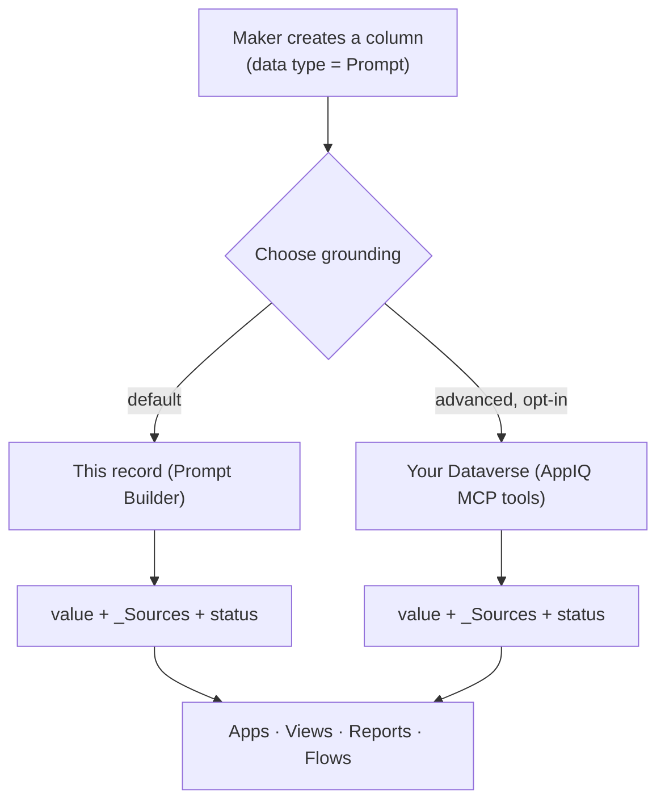
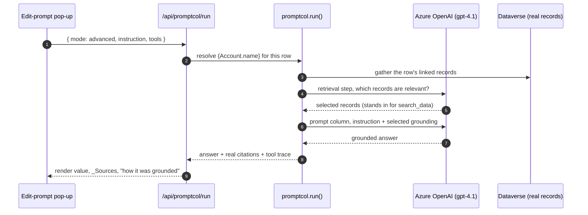
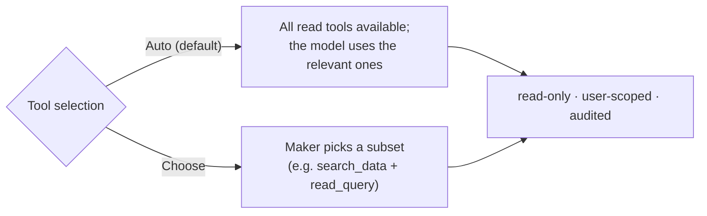
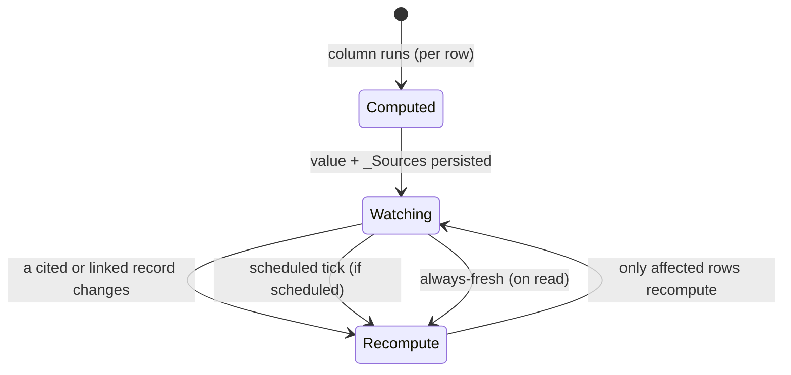

# Architecture and design

How grounded prompt columns work, why the advanced option is a different retrieval
paradigm, and how the live demo is wired.

## The shape of the feature

A prompt column runs an AI Builder prompt on every row and writes the result to a
field. This proposal adds a **second grounding option** to that column.

The output is deliberately identical for both modes, so every downstream surface
reads the field the same way. Only the grounding differs.

## Why the advanced option is a different paradigm

Prompt Builder is not limited to a single row. With **Add knowledge** it pre-wires
related tables (a few hops, attribute filters). Three things remain out of reach, and
they are structural, not configuration.

| Capability | This record | Your Dataverse (AppIQ) |
| --- | --- | --- |
| Retrieval | fixed, chosen at design time | run-time tool calls, chosen per row |
| Unstructured / semantic | no | yes, notes and files, by meaning |
| Cross-record / aggregate | no | yes, queries and JOINs across tables |
| Output | value + citations | value + citations (identical) |

The moat is not *more data*, it is a *different way of retrieving it*: fixed,
maker-wired knowledge versus a read-only agent that searches and queries all of
Dataverse and cites what it used.

## The per-row loop (live demo)

In the demo, `web/app/promptcol.py` implements the loop. Because the trial org has
Dataverse search disabled, retrieval is emulated with a model meaning-match over the
real records; the record IDs, links, and citations are all real.

Turning `search_data` off in the tool selector drops the notes from the grounding,
and the answer degrades to structured-only, which demonstrates the value of semantic
search.

## Tool selection

The maker controls which MCP tools the column may call.

Read tools: `search_data`, `search`, `read_query`, `fetch`, `describe_table`,
`list_tables`. The write and delete tools are never exposed.

## Freshness

Each value cites the records it used, so the column knows its own dependencies.

Default is refresh-on-change. Always-fresh and scheduled are maker options in the
portal. Only affected rows recompute.

## Guardrails

- **Read-only.** No create, update, or delete tools on a prompt column.
- **User-scoped.** Retrieval is trimmed to what the signed-in user may read.
- **Maker-scoped.** The maker chooses which tables and tools are in play.
- **Auditable.** Every tool call is recorded.
- **Opt-in.** Existing columns keep Prompt Builder unchanged; the advanced controls
  and their concerns are isolated to the advanced mode.
